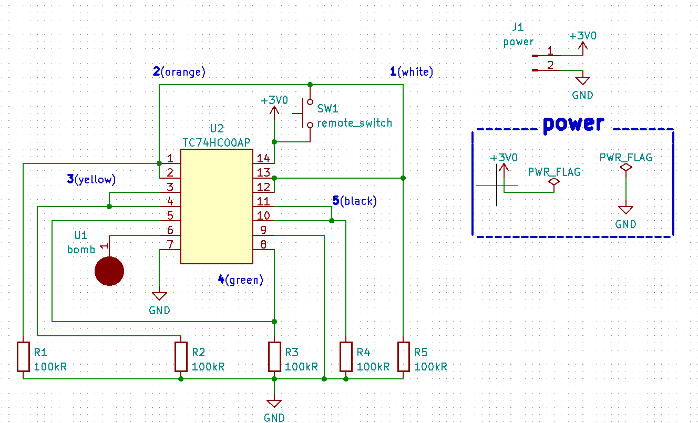

# DefuseBomb

DefBom1.jpgを見ていくと「TC74HC02AP」、「TC74HC08AP」と書いてある部品があるので調べるとそれぞれ2入力のNORゲート、ANDゲートのICであることがわかります。しかし、このICには14のピンがそれぞれどのような入出力を行うのか知る必要があるのでTC74HC02AP,TC74HC08APのデータシート(取扱説明書)を入手します(「TC74HC02AP データシート」とかで検索すると入手できます)NANDゲートについては論理回路やディジタル回路の教科書やサイト等を参考にして下さい。  
あとは6つの線それぞれを切断したときにlimit_timerがON、OFFの状態でのbombに信号が流れるかを調べます。4を切断すると解除成功です。2,3,5は切断してもlimit_timerがON状態になると爆発、1,6は切断した瞬間爆発します。  
ちなみに今回使用されている抵抗はプルダウン抵抗と呼ばれる役割を果たしています（詳細は下記リンク等を参照）  
https://voltechno.com/blog/pullup-pulldown/  
  
DefBom2.jpgの回路図の記号に見覚えのない方は、IRF3205がNチャンネルMOSFETであることを確認します。
MOSFETについてはアナログ回路や半導体の教科書等を参考にして下さい。
あとは5つの線それぞれを切断したときにlimit_timerがON、OFFの状態でのbombに信号が流れるかを調べます。４を切断すると解除成功です。1,2は切断してもlimit_timerがON状態になると爆発、3,5は切断した瞬間爆発します。  
ちなみにDefBom2はNチャンネルMOSを２つ組み合わせることによってできたNANDゲートを4つ組み合わせた回路になっています。  
https://qiita.com/niQSun/items/251e5824c70724a7d2c0#%E3%81%A7%E3%81%AF2%E5%80%8B%E4%BD%BF%E3%81%A3%E3%81%9F%E3%82%89  
  
DefBom3はzipファイルの中に特徴的な拡張子があるので調べると、このzipファイルはガーバーデータと呼ばれるものだと分かります。ガーバーデータを見る方法としてはオンラインでガーバーデータを閲覧できるサイトで見る or 基板設計ソフトウェアで見るといった方法があります。  
ちなみに昨年のTsukuCTFで「PCB」に取り組まれた方は察しが付いたのではないかと思います。  
あとは「TC74HC00AP」と書いてある謎の部品があるので調べると2入力のNANDゲートのICであることがわかります。TC74HC00APのデータシートは下記リンク参照。  
https://akizukidenshi.com/download/ds/toshiba/TC74HC00A.pdf  
NANDゲートについては論理回路やディジタル回路の教科書、下記のリンク先等を参考にして下さい。  
https://www.maximintegrated.com/jp/glossary/definitions.mvp/term/nand-gate/gpk/1203  
あとは5つの線それぞれを切断したときにlimit_timerがON、OFFの状態でのbombに信号が流れるかを調べます。2を切断すると解除成功です。1,5は切断してもlimit_timerがON状態になると爆発、3,4は切断した瞬間爆発します。また、回路図はこちらのようになります。  
  

ちなみにDefBom2とDefBom3は論理ゲートの回路に描きなおすと実は同じです。（切断する番号だけ変えてます）
`TsukuCTF22{442}`

# 補足
昨年「SECCON Contests」で行われた疑似時限爆弾解除競技「Juggernaut」からヒントを得て作問しました。  
https://www.seccon.jp/2021/seccon_contest/secconcon.html  
https://github.com/Alignof/Juggernaut  
今回のような問題はCTFではあまり出題されないため、参加者の皆様の中でも賛否が分かれると思います。なのでwriteupやアンケート等で感想等を書いて頂けると幸いです（この問題に限らずですが